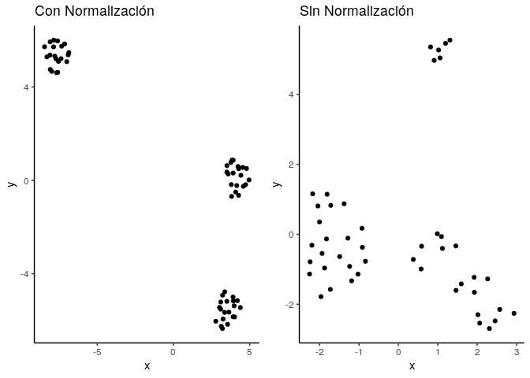

*El problema*: Clusterizar diseños

¿Como hago para clasificar estilos de banners?

    knitr::include_graphics("/img/banner-example.png")

Con tantos adds dando vueltas en internet, sigue siendo, muchas veces,
un proceso relativamente manual y poco estandarizado los diseños. Para
eso existen diseñadores.

Pero cuando ya tienen miles realizados, esta bueno mirar atrás e
identificar patrones recurrentes. Saber lo que venimos haciendo sirve
para mirar hacia adelante.

**Input data**

El problema tenia originalmente cientos de diseños, en este ejemplo,
dado que tiene que ver con algoritmos de clusterización, se usaran
algunos hechos ad hoc, por lo que el ejemplo es con tamaños reducidos y
la clasificacion de imagenes, fuentes de texto y demás quedan afuera. Lo
que queremos saber es si la ubicación de los elementos en la imagen
sigue un patron en particular.

Los datos venian de la siguiente forma:

Donde:

-    *y* : Distancia desde arriba 

-    *x* : Distancia desde la izquierda 

-    *w* : Ancho (width) 

-    *h* : Alto (height) 

Si tenemos 50 ejemplos, con 3 elementos cada uno, y hay 4 variables por
elemento, la forma del input es 50 × 3 × 4, esto, a los algoritmos, no
les gusta demasiado. Asique fue necesario achatar la base para obtener
una base de datos de 50 × 12, para lo cual:

Primero se agarra cada uno (una base de 1 × 3 × 4) y se la transforma en
una sola fila 1 × 12 para lo cual se uso el código:

    library(tidyverse)
    cols_used = c('element_top', 'element_left', 'element_width', 'element_height')
    spread_file<-function(data, cols_used){
      cols_used_a = c('element_name',cols_used)
      y=data[cols_used]
      h = data[cols_used_a]
      z=c(1,1,1,1)
      for(i in 1:nrow(y)) {
        z = cbind(z,y[i,])
      }
      z = z[1,-1] 
      
      newcols <- c()
      for (i in  h['element_name']){
        newcols<-cbind(newcols,paste(i,cols_used[1], sep = '.'))
        newcols<-cbind(newcols,paste(i,cols_used[2], sep = '.'))
        newcols<-cbind(newcols,paste(i,cols_used[3], sep = '.'))
        newcols<-cbind(newcols,paste(i,cols_used[4], sep = '.'))
      }
      newcols2<-c()
      for(i in 1:nrow(newcols)) {
        for(j in 1:4){
          newcols2<-c(newcols2,newcols[i,j])
        }
      }
      colnames(z)<-newcols2
      n<-as_vector(data['id'])
      z['id']<-n[1]
      z
    }

Lo que transforma cada elementos con la forma:

$$
\\begin{bmatrix} 
   elem1 & y\_1 & x\_1 & w\_1 & h\_1 \\\\
   elem2 & y\_2 & x\_2 & w\_2 & h\_2  \\\\
   \\vdots \\\\
   elemk & y\_2 & x\_k & w\_k & h\_k  \\\\
   \\end{bmatrix} 
$$
 a la forma:

%
Así se pueden apilar todos elementos de la muestra para quedar una sola
base de datos con la forma:

%
-    Reduccion de dimensionalidad + Clustering 

<!-- -->

    library(umap)
    library(dbscan)
    #umap_data<- umap(data)
    #cl <-hdbscan(x = umap_data, minPts = 3)

    knitr::include_graphics("/img/sin_norm2.png")

-    Se puede ver un grupo diferenciado, pero los demas
    no estan tan claros. 

**Validacion**

*En terminos de negocio…¿sirve hacer esto?*

-    Al separar en diferentes carpetas los archivos de
    cada cluster generado, los diseñadores no estaban conformes, habia
    diseños distintos que habian sido clasificados como similares

    #knitr::include_graphics("preguntas-768x449.jpg")

**Estrategia 2**

 Surge la necesidad de transformar los datos

Opciones 

-    Estandarizacion (z-score): Representa el numero de
    desvios estandar arriba o debajo del valor resultante. **Útil para
    variables normalmente distribuidas** 

-    Normalizacion (min-max scaler): Permite llevar los
    valores entre 0 y 1. **Útil para comparar variables de diferentes
    ordenes de magnitud** (Precio de una casa y los m2 que ocupa)
    

<!-- -->

    knitr::include_graphics("/img/normaliz_data.png")

**¿Puedo usar estas transformaciones en estos datos?**

-   No, como las variables describen dimensiones (alto y ancho), y
    posicion en el espacio no le encontré mucho sentido a la
    estandarizacion ni la normalizacion.

-   ¿Que podría hacer? En lugar de ver las posiciones y dimensiones
    *absolutas*, ver las posiciones y dimensiones *relativas*, lo que
    voy a llamar “normalizacion geometrica”

<!-- -->

    #knitr::include_graphics("img_rel.jpg")

Normalizacion “geometrica”
--------------------------

-   x’ es la proporcion de x respecto al rango total (ancho del canvas)

 *mi nueva variable x’ es: la linea roja dividida la
linea azul* 

    knitr::include_graphics("/img/demo_plot_y.jpeg")

Normalizacion “geometrica”
--------------------------

-   y’ es la proporcion de y respecto al rango total (alto del canvas)

 *mi nueva variable y’ es: la linea roja dividida la
linea azul* 

    knitr::include_graphics("/img/demo_plot_y.jpeg")

Normalizacion “geometrica”
--------------------------

-   areaRelativa es la proporcion del area del elemento respecto al
    total

 *mi nueva variable areaRelativa es: el area del cuadrado
chiquito dividido la del rectangulo grande* 

Normalizacion “geometrica”
--------------------------

-   disposicion (dividiendo alto por acho) es para saber si el elemento
    es horizontal, vertical, o cuadrado

 *mi nueva variable disposicion es: el alto dividido por
el ancho* 

    knitr::include_graphics("/img/rectangular.png")

Resultados
----------

