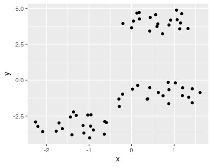
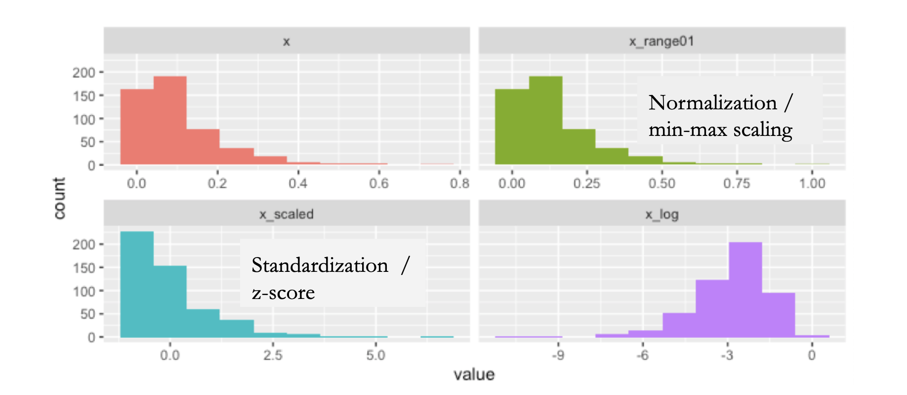
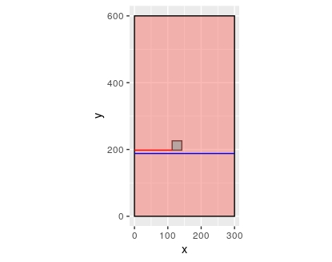
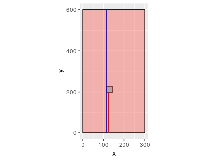
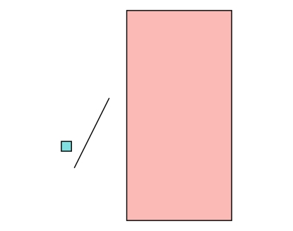
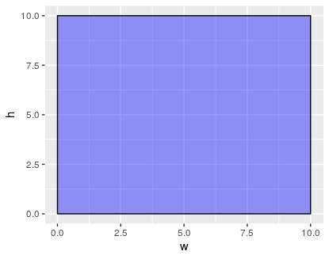

```{r setup, include=FALSE}
knitr::opts_chunk$set(echo = FALSE)
```

##
_El problema_: Clusterizar diseños

¿Como hago para clasificar estilos de banners?


```{r, out.width = "400px"}

```


##
 
**Input data**


```{r, out.width= "65%", out.extra='style="float:left; padding:20px"'}
knitr::include_graphics("input_data.png")
```


* <font size = 3> _y_ : Distancia desde arriba </font>

* <font size = 3> _x_ : Distancia desde la  izquierda </font>

* <font size = 3> _w_ : Ancho (width) </font>

* <font size = 3> _h_ : Alto (height) </font>

## 

Estrategia 1: 


*  <font size = 3> Reduccion de dimensionalidad  + Clustering  </font>

```{r, eval=F, echo=T, size='tiny'} 

library(umap)
library(dbscan)
umap_data<- umap(data)
cl <-hdbscan(x = umap_data, minPts = 3)

```
```{r, out.width= "45%", out.extra='style="float:left; padding:20px"'}


```


* <font size = 3>
 Se puede ver un grupo diferenciado, pero los demas no estan tan claros.
</font>

* <font size = 3>
 Al separar en diferentes carpetas los archivos de cada cluster generado, los diseñadores no estaban conformes, habia diseños distintos que habian sido clasificados como similares

</font>

## 
¡Es necesario transformar los datos!

Opciones:

* <font size = 3> Estandarizacion (z-score): Representa el numero de desvios estandar arriba o debajo del valor resultante. Útil para variables normalmente distribuidas </font>

* <font size = 3> Normalizacion (min-max scaler): Permite llevar los valores entre 0 y 1. Útil para comparar variables de diferentes ordenes de magnitud (Precio de una casa y los m2 que ocupa) 
</font>

```{r, out.width= "85%", out.extra='style="float:left; padding:20px"'}


```


## ¿Que tienen en comun?


- En ambos casos las variables no estan necesariamente interrelacionadas entre si.
- Cada variable es una variable real.


## MinMax Scaler:


$$x' = {{x - min(x)} \over max(x)- min(x)}.$$

- Preserva la forma de la distribucion
- Es util para hacer que los datos esten en un rango entre [0,1]
- **Representa** la proporcion del rango de cada punto respecto al rango de valores que toma la variable 

## Normalizacion

$$x' = {{x - mean(x)} \over max(x)- min(x)}.$$

- Transforma las observaciones para que puedan ser descriptas como una distribucion Normal  
- Es util para hacer que los datos esten en un rango entre [0,1]
- **Representa** la proporcion de la distancia a la media de cada punto respecto al rango de valores que toma la variable 


## ¿Que tienen en comun?


- En ambos casos las variables no estan necesariamente interrelacionadas entre si.
- Cada variable es una variable real.

## ¿Que hacer con variables complejas?

$$ z =  x + i*y $$

- ¿Como hacer que las variables esten entre [0,1] 
- La normalizacion o la minmax, me hacian perder tangibilidad de los datos. Esto es, deje de poder entender que significaba lo que estaba viendo.
- Los datos, ademas de coordenadas, describen dimensiones 
  - [x,y,h,w] donde:
    - [x,y] describen la posicion
    - [h,w] describen el tamaño (heigth, width)


## Normalizacion "geometrica"

$$x' = {{max(x)-x} \over max(x)} $$

- x' es la proporcion de x respecto al rango total (ancho del canvas)



## 

$$y' = {{max(y)-y} \over max(y)} $$

- y' es la proporcion de y respecto al rango total (alto del canvas)




##  
$$areaRelativa = {{h*w} \over x*y} $$

- areaRelativa es la proporcion del area del elemento respecto al total




##
$$posicion = {{h} \over w}  $$

- posicion es para saber si el elemento es horizontal(<1), vertical(>1), o cuadrado(=1)




## Resultados


```{r echo=FALSE,message=FALSE}
library(png)
library(grid)
library(plotly)
library(tidyverse)
#img1 <- readPNG("./sin_escalar.png")
#img2 <- readPNG("./con_escalar.png")
df_an<-read_csv('df_an.csv')
p <- df_an %>%
  plot_ly(
    x = ~x, 
    y = ~y,
    frame = ~version, 
    type = 'scatter',
    mode = 'markers'
  ) 
p

#grid.raster(img1)
#grid.raster(img2)
```

