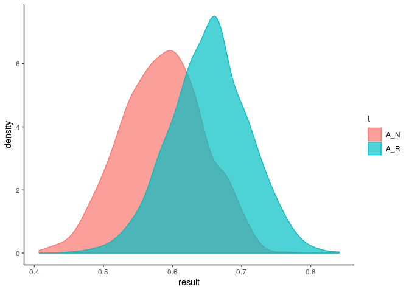

Interpretación bayesiana de la matriz de confusión
==================

¿Cómo evaluar modelos si solo tenemos la matriz de confusión?

Esta interpretación pertenece originalmente a un paper homónimo de
Olivier Caelen (2000).Pero es una interesante forma de entender la
matriz de confusión, por lo que esto será una
traducción/interpretación/resumen de aquel.

<a href="https://lucasenrich.netlify.com/post/bayes_cm/">Read more </a>

<!--more--> 

La matriz de confusión puede ser a veces muy confusa, falsos positivos,
falsos negativos, verdaderos positivos, verdaderos negativos; y todas
las métricas que salen de ahi, el recall, el accuracy, el F-score.

Todas ellas se basan en la evidencia concreta de los set testeados, pero
no indican cuanta incertidumbre hay en tal o cual indicador.

Supongamos que comparamos dos modelos, uno tiene 72% de precisión y el
otro 70%. Dado que se trabaja con datos muestreados aleatoriamente (ya
sea por el muestreo de dataset usado para hacer el modelo, ya sea por
train-test split), los valores que terminan en la matriz de confusión
también son fruto de un proceso aleatorio.

Para las tecnicas bayesianas, cualquier estimación es contingente a los
datos obtenidos y a las creencias que tiene quien investiga. Asimismo,
todo lo estimado tiene una distribución especifica que puede ser
investigada.

#### *La matriz de Confusión*

Dado un dataset, se genera un modelo que mapea *X* a *Y*, esto puede ser
escrito como: $h: x y $, pero a veces se le pifia, y a veces no.

El diagrama que implica la matriz de confusión es:

<Diagrama>

Pero podemos pensar en la matriz de confusión como un vector de valores:

*V* = (*n*°*T**P*, *n*°*T**N*, *n*°*F**P*, *n*°*F**N*)

#### *El planteo Bayesiano*

Este vector númerico, *V*, puede ser entendido como que vino de una
función de distribución multinomial, la cual es una generalización de la
binomial, solo que en lugar de tener dos valores posibles los cuales
tienen una probabilidad cada uno, hay cuatro los cuales dependen de los
parametros de la distribución binomial.

*V* − *M**u**l**t*(*N**T*, *θ*)

Donde:

*θ* = (*θ**t**p*, *θ**t**n*, *θ**f**p*, *θ**f**n*)

Son los parametros que determinan la realización de los valores dentro
de *V*, es decir *v* depende de *θ*.

Entonces, si los valores de la matriz de confusión son aleatorios con
una función de distribución de probabilidad dada, la probabilidad de
obtener un set de valores *v* que llene el vector que contiene los
valores de la matriz de confusión *V* puede escribirse como
*P*(*V* = *v*), en este caso, se considera que *θ* es fijo.

Pero si *θ* proviene de una variable aleatoria, esto es, no es fijo,
*P*(*V* = *v*) se vuelve contingente a los valores que pueda tomar *θ*,
por lo que se podria escribirse:

*P*(*V* = *v*|*Θ* = *θ*)

Y de acá proviene el planteo bayesiano, yo quiero conocer *Θ*, pero solo
veo las realizaciones de la matriz de confusión *v*, por lo que no
quiero *P*(*V* = *v*|*Θ* = *θ*), sino *P*(*Θ* = *θ*|*V* = *v*), lo cual
se puede escribir según la regla de bayes:

$$
f\_{\\Theta|V}(\\theta|v) = \\frac{P(V=v|\\Theta=\\theta)\*f\_{\\Theta}(\\theta)}{P(V=v)}
$$

Este planteo permite comparar distintos modelos sin otra necesidad que
los valores de la matriz de confusión.

### *El prior*

En analisis bayesiano hay distribuciones que van de la mano, que son
como amigas. Es decir, si mis variables tienen una funcion de
distribución determinada, los parametros tienen tal otra, se llaman
conjugados. El amigo de la distribución multinomial, es la Dirichlet.

En nuestro caso, *v* sigue una distribución multinomial, y *θ* una
distribución Dirichlet.

*V* − *M**u**l**t*(*N**T*, *θ*)
*Θ* − *D**i**r*(*α*)=*D**i**r*((*α*1, *α*2, *α*3, *α*4))

Ahora bien, ¿Que es *α*? Bueno, *α* no es mas ni menos que el lugar
donde se mete el prior, porque dado mi matriz de confusión *v*, la
posterior de *Θ* esta dada por:

*Θ*|*ω* = *D**i**r*((*v*1 + *α*1, *v*2 + *α*2, *v*3 + *α*3, *v*4 + *α*4)) = *D**i**r*(*ω*)

Entonces, habiendo visto los datos *v*, y habiendo metido nuestro
conocimiento previo *α* (que puede ser la matriz de confusión de otro
modelo, o del mismo modelo con nuevos datos, o el prior relevante al
caso concreto), y la posterior *D**i**r*(*ω*) nos va a dar los
parametros que correspondan darle a la multinomial que nos da las
distribuciones de cada uno de los elementos de la matriz de confusión.

¿Como se vuelve operativo esto?

Simulando, si tenemos los parametros de *D**i**r*(*ω*) como resultado de
nuestro analisis, no vamos a tener los *θ*, sino que podemos extraer los
parametros de *θ* con una frecuencia que refleje la distribución de
*D**i**r*(*ω*).

Para simplificar podemos elegir una métrica a evaluar, en este caso, el
accuracy, que depende de matriz de confusión *A*(*v*)

Esto es un algoritmo Monte Carlo

*for i in 1:M:*

-   *Vamos a la caja *D**i**r*(*ω*) y sacamos los *θ**i**

-   *Ponemos los *θ**i* en *P*(*V* = *v*|*Θ* = *θ*) y sacamos
    los *v**i**

-   *Sacamos *A*(*v**i*) y lo guardamos en una lista*

Esto va a dar una lista de un montón (M) de A(v), este listado tiene sus
propios estadisticos, su media y su varianza.

¿Confuso? Seguro, no te culpo, yo también lo estoy y eso que estoy
ecribiendo esto, pero veamos concretamente como se puede aplicar esto en
la práctica

#### *Ejemplo 1:*Comparando dos modelos

Supongamos que, de un mismo dataset, hicimos, ponele, un randomForest
(R) y un NaiveBayes (N) y la matriz de confusión de c/u es:

$$
v^R=\\begin{bmatrix}65 & 15 \\\\ 35 & 30\\end{bmatrix} = (65,30,35,15)
$$
$$
v^N=\\begin{bmatrix}50 & 30 \\\\ 30 & 35\\end{bmatrix} = (50,35,30,30)
$$
 Vamos a decir, que no tenemos información previa, porque lo que estamos
haciendo es comparar dos modelos, es decir que *α* en ambos casos, será
(0, 0, 0, 0)

    library(DirichletReg)

    ## Loading required package: Formula

    ## Loading required package: rgl

    library(extraDistr)

    ## 
    ## Attaching package: 'extraDistr'

    ## The following objects are masked from 'package:DirichletReg':
    ## 
    ##     ddirichlet, rdirichlet

    M = 1000
    alpha = c(0,0,0,0)

    #Para v_R
    v_R = c(65,30,35,15)
    omega_R = alpha + v_R
    A_R = c()

    for(i in 1:1000){
      theta_i = t(rdirichlet(1,omega_R))
      v_i = rmnom(1, sum(v_R), as.vector(theta_i))
      A_i = (v_i[1]+v_i[2])/sum(v_i)
      A_R = c(A_R,A_i)
    }

    #Para v_N
    v_N = c(50,35,30,30)
    omega_N = alpha + v_N
    A_N = c()

    for(i in 1:1000){
      theta_i = t(rdirichlet(1,omega_N))
      v_i = rmnom(1, sum(v_N), as.vector(theta_i))
      A_i = (v_i[1]+v_i[2])/sum(v_i)
      A_N = c(A_N,A_i)
    }

Ahora se pueden visualizar las distribuciones resultantesde estas
simulación

    ## ── Attaching packages ────────────────────────────────────────── tidyverse 1.2.1 ──

    ## ✔ ggplot2 3.2.1     ✔ purrr   0.3.2
    ## ✔ tibble  2.1.3     ✔ dplyr   0.8.3
    ## ✔ tidyr   0.8.3     ✔ stringr 1.4.0
    ## ✔ readr   1.3.1     ✔ forcats 0.4.0

    ## ── Conflicts ───────────────────────────────────────────── tidyverse_conflicts() ──
    ## ✖ dplyr::filter() masks stats::filter()
    ## ✖ dplyr::lag()    masks stats::lag()
    ## ✖ purrr::rdunif() masks extraDistr::rdunif()

En este caso, puede verse que el mejor modelo es el randomForest (R), ya
que su distribución está más a la derecha.

De aquí puede extraerse también los intervalos de confianza y (de
credibilidad para el marco bayesiano) y otras cuestiones.

Otra cosa para lo cual se puede usar este método es para evaluar de
forma muy barata cuan vigente es un model en funcionamiento a nueva
información.

Si nos matamos haciendo un modelo que llego a un accuracy del 97% en el
set de test y un día con información nueva, llega a un accuracy del 90%,
es posible saber que tan probable sería encontrar tal resultado o si el
modelo necesita ser re-entrenado, es solo cuestión de que
*α* = (*M**C*0) donde *M**C*0 es la matriz de
confusión al momento 0.
