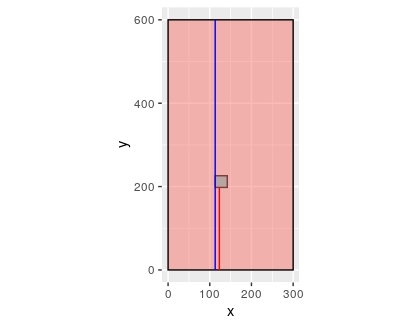

*El problema*: Clusterizar diseños

¿Como hago para clasificar estilos de banners?

**Input data**

*Se sacan metadatos de un archivo de photoshop*

-    *y* : Distancia desde arriba 

-    *x* : Distancia desde la izquierda 

-    *w* : Ancho (width) 

-    *h* : Alto (height) 

Estrategia 1:

-    Reduccion de dimensionalidad + Clustering 

<!-- -->

    library(umap)
    library(dbscan)
    umap_data<- umap(data)
    cl <-hdbscan(x = umap_data, minPts = 3)

-    Se puede ver un grupo diferenciado, pero los demas
    no estan tan claros. 

**Validacion**

*En terminos de negocio...¿sirve hacer esto?*

-    Al separar en diferentes carpetas los archivos de
    cada cluster generado, los diseñadores no estaban conformes, habia
    diseños distintos que habian sido clasificados como similares

**Estrategia 2**

 Surge la necesidad de transformar los datos

Opciones 

-    Estandarizacion (z-score): Representa el numero de
    desvios estandar arriba o debajo del valor resultante. **Útil para
    variables normalmente distribuidas** 

-    Normalizacion (min-max scaler): Permite llevar los
    valores entre 0 y 1. **Útil para comparar variables de diferentes
    ordenes de magnitud** (Precio de una casa y los m2 que ocupa)
    

**¿Puedo usar estas transformaciones en estos datos?**

-   No, como las variables describen dimensiones (alto y ancho), y
    posicion en el espacio no le encontré mucho sentido a la
    estandarizacion ni la normalizacion.

-   ¿Que podría hacer? En lugar de ver las posiciones y dimensiones
    *absolutas*, ver las posiciones y dimensiones *relativas*, lo que
    voy a llamar "normalizacion geometrica"

Normalizacion "geometrica"
--------------------------

-   x' es la proporcion de x respecto al rango total (ancho del canvas)

 *mi nueva variable x' es: la linea roja dividida la
linea azul* 

Normalizacion "geometrica"
--------------------------

-   y' es la proporcion de y respecto al rango total (alto del canvas)

 *mi nueva variable y' es: la linea roja dividida la
linea azul* 

Normalizacion "geometrica"
--------------------------

-   areaRelativa es la proporcion del area del elemento respecto al
    total

 *mi nueva variable areaRelativa es: el area del cuadrado
chiquito dividido la del rectangulo grande* 

Normalizacion "geometrica"
--------------------------

-   disposicion (dividiendo alto por acho) es para saber si el elemento
    es horizontal, vertical, o cuadrado

 *mi nueva variable disposicion es: el alto dividido por
el ancho* 

Resultados
----------

